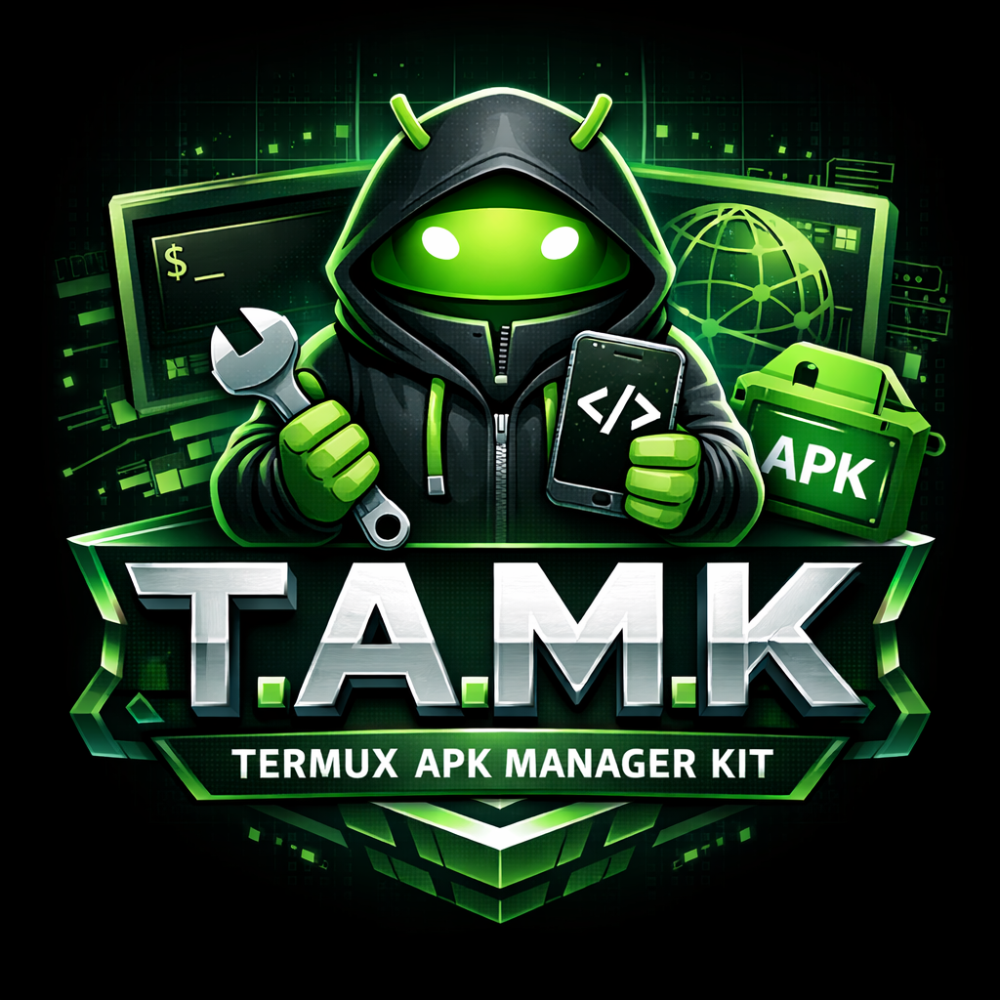

# 📱 T.A.M.K — Termux APK Manager Kit (v2026)

**T.A.M.K** é um framework de automação profissional para desenvolvimento nativo de aplicativos Android diretamente no Termux. Permite criar, compilar, assinar e instalar APKs usando apenas um dispositivo móvel.

<p align="center">
  
</p>

<p align="center">
  
  
  
  
</p>

---

## 📋 Tabela de Conteúdos

- [✨ Diferenciais](#-diferenciais)
- [🏗️ Arquitetura](#-arquitetura)
- [⚙️ Instalação](#-instalação)
- [📖 Guia de Comandos](#-guia-de-comandos)
- [🏭 Tipos de Projeto](#-tipos-de-projeto)
- [🔧 Pipeline de Build](#-pipeline-de-build)
- [🔥 Modo Dev & HMR](#-modo-dev--hmr)
- [🔄 Sistema de Atualizações](#-sistema-de-atualizações)
- [📂 Estrutura do Projeto Gerado](#-estrutura-do-projeto-gerado)
- [📚 Documentação](#-documentação)
- [❓ FAQ](#-faq)

---

## ✨ Diferenciais

| Funcionalidade | Descrição |
| :--- | :--- |
| **3 Tipos de Projeto** | UI APK nativo, Console Kotlin, WebApp híbrido (WebView) |
| **WebApp com URL Remota** | Suporte a carregamento de URLs externas no WebView |
| **Hot Module Replacement** | Desenvolvimento em tempo real com WebSocket, live reload CSS/JS/JSON, preservação de estado |
| **Build Incremental** | Atualização rápida de assets sem rebuild completo |
| **Assinatura Segura** | Keystore privada por projeto + validação de senha pré-build |
| **Cache Inteligente** | Build pulado se nada mudou (hash SHA-256) |
| **ADB Integration** | Auto-instalação e push de assets via ADB |
| **Isolamento de SDK** | Cada projeto com `android.jar` próprio, sem conflitos |
| **Template Engine** | Arquivos `.tmpl` com placeholders — customização sem alterar o núcleo |
| **Sistema de Updates** | Verificação automática via GitHub API com níveis de prioridade |
| **Instalação Nativa** | `termux-share` ou fallback via Activity Manager |
| **Instalador Automático** | Script `setup-install.sh` configura tudo |

---

## 🏗️ Arquitetura

```
CLI (main.py) → Controllers → Factory → Structure Classes → Template Engine → Projeto Gerado
                                         ↓
                                    BuildController → APK Assinado
```

### Componentes

| Camada | Arquivos | Responsabilidade |
| :--- | :--- | :--- |
| **CLI** | `src/main.py` | Parsing de argumentos, roteamento para handlers |
| **Controllers** | `src/controllers/` | Lógica de negócio (build, dev, setup, install, run) |
| **Factory** | `src/organization/factory.py` | Distribuição para estrutura correta |
| **Structures** | `src/organization/structures/` | Blueprints de cada tipo de projeto |
| **Templates** | `assets/templates/` | Arquivos `.tmpl` com placeholders |
| **Config** | `src/config/tamk_config.py` | Config centralizada (VERSION, SDK, paths) |
| **Utils** | `src/utils/` | Logger, banner, cores, watcher, updater |

---

## ⚙️ Instalação

### Pré-requisitos

```bash
pkg update && pkg upgrade
pkg install -y python openjdk-21 kotlin wget zip apksigner aapt2 termux-tools git ncurses-utils toilet
pip install watchdog websockets
```

### Instalação Automática (Recomendada)

```bash
git clone https://github.com/Shadw-Developer/tamk.git
cd tamk
bash setup-install.sh
```

**O que o instalador faz:**
1. Detecta ambiente (Termux ou SmartIDE)
2. Verifica e instala dependências faltantes
3. Copia arquivos para `$PREFIX/opt/tamk`
4. Cria executável global `tamk`
5. Configura diretórios (sdk, cache, projects)
6. Cria arquivo de configuração padrão

### Verificação

```bash
tamk --version
# ✨ T.A.M.K Version: 2026.3.0-HMR
#    Environment: termux
#    Home: /data/data/com.termux/files/usr/opt/tamk
```

### Desinstalação

```bash
rm "$PREFIX/bin/tamk"
rm -rf "$PREFIX/opt/tamk"
rm -rf ~/.tamk_cache
```

---

## 📖 Guia de Comandos

### Comandos Principais

| Comando | Descrição | Exemplo |
| :--- | :--- | :--- |
| `tamk --create` | Assistente interativo de criação | `tamk --create` |
| `tamk --build` | Compila e assina APK | `tamk --build -p minhasenha` |
| `tamk --dev` | Modo desenvolvimento com HMR | `tamk --dev --verbose` |
| `tamk --run` | Executa projeto console ou snippet | `tamk --run src/Teste.kt` |
| `tamk --install` | Instala APK no dispositivo | `tamk --install` |
| `tamk --setup` | Configura SDK e keystore global | `tamk --setup` |
| `tamk --update` | Verifica e instala atualizações | `tamk --update` |
| `tamk --version` | Mostra versão e ambiente | `tamk --version` |
| `tamk --ide` | Abre SmartIDE | `tamk --ide` |

### Opções Globais

| Flag | Descrição |
| :--- | :--- |
| `-p, --password SENHA` | Senha da keystore (solicitada se omitida) |
| `-V, --verbose` | Logs detalhados (DEBUG) |
| `--no-ws` | Desabilita WebSocket no modo dev (usa HTTP) |
| `--ws-port PORTA` | Porta do WebSocket (padrão: 8765) |
| `--no-update-check` | Desabilita verificação automática de atualizações |

### Exemplos Rápidos

```bash
# Criar projeto
tamk --create

# Build com senha
cd MeuApp && tamk --build -p 123456

# Modo desenvolvimento HMR
tamk --dev

# Modo dev sem WebSocket
tamk --dev --no-ws

# Executar console
tamk --run

# Instalar APK gerado
tamk --install

# Verificar atualizações manualmente
tamk --update

# Ver versão
tamk --version
```

---

## 🏭 Tipos de Projeto

### Fluxo de Criação

```
tamk --create
├── 1. Nome do projeto
├── 2. Author
├── 3. Versão (semver)
├── 4. Engine:
│   ├── [1] Console          → Kotlin CLI
│   ├── [2] UI/APK           → Android nativo XML/Kotlin
│   └── [3] WebApp           → WebView híbrido
│       ├── Interno (assets/)
│       └── Externo (URL remota)
└── 5. Senha da Keystore (se aplicável)
```

### WebApp — Modos de Conteúdo

| Modo | Descrição | Exemplo |
| :--- | :--- | :--- |
| **Interno** | Arquivos estáticos em `src/main/assets/` | `file:///android_asset/index.html` |
| **Externo** | URL remota carregada no WebView | `https://meusite.com/app` |

### Comparação

| Característica | UI APK | Console | WebApp |
| :--- | :--- | :--- | :--- |
| Interface | XML nativa | Terminal | HTML/CSS/JS via WebView |
| Linguagem | Kotlin | Kotlin | Kotlin + HTML/JS |
| Keystore | ✅ Obrigatória | ❌ | ✅ Obrigatória |
| HMR | ❌ | ❌ | ✅ Completo |
| `--run` | ❌ | ✅ | ❌ |
| Geração de APK | ✅ | ❌ | ✅ |

---

## 🔧 Pipeline de Build

### Build Completo (`tamk --build`)

1. ✅ **Validação** — SDK existe? Senha ≥ 6 caracteres?
2. 🔍 **Hash Check** — SHA-256 de todos os fontes vs cache
3. 🏗️ **AAPT2 Compile** — `aapt2 compile --dir res -o res.zip`
4. 🔗 **AAPT2 Link** — `aapt2 link -I android.jar --manifest AndroidManifest.xml -o app.apk [-A src/main/assets]`
5. ☕ **Kotlin Compile** — `kotlinc src gen/ -cp android.jar -d obj/`
6. 📦 **D8 DEX** — `d8 --lib android.jar --release --output . *.class`
7. 📎 **Zipalign** — `zipalign -f 4 app.apk app-unsigned.apk`
8. ✍️ **Assinatura** — `apksigner sign --ks keystore --out app-final.apk`
9. 🧹 **Cleanup** — Remove temporários, salva `.build_cache`

### Build Incremental (Dev Mode)

```
build_assets_only():
1. Extrai APK existente (app-final ou app-dev)
2. Remove pasta assets/ antiga
3. Copia src/main/assets/ atual
4. Reempacota + assina → app-dev.apk
5. Auto-instala via ADB (se conectado)
```

### Cache Inteligente

- Arquivo `.build_cache` guarda hashes SHA-256
- Se nada mudou → build pulado em < 1s
- Arquivos monitorados: `src/`, `res/`, `AndroidManifest.xml`
- Pastas ignoradas: `.git`, `cache`, `secret`, `__pycache__`

---

## 🔥 Modo Dev & HMR

### Iniciar

```bash
cd MeuWebApp
tamk --dev
```

### O que acontece

1. Validação: projeto WebApp, assets/ existe, APK base existe
2. Injeção do bridge `tamk-dev-bridge.js` no `index.html` (backup criado)
3. Inicia **WebSocket Server** (porta 8765)
4. Inicia **HTTP Server** (porta 8080, fallback)
5. Inicia **File Watcher** em `src/main/assets/`
6. Build inicial dos assets
7. Loop de comandos interativos

### Comandos Interativos

| Tecla | Ação |
| :--- | :--- |
| `b` | Rebuild forçado |
| `i` | Instala APK |
| `s` | Status (uptime, builds, clientes, módulos) |
| `h` | Ajuda |
| `q` / Ctrl+C | Encerra |

### Tipos de HMR

| Arquivo | Ação | Reload? | Estado |
| :--- | :--- | :--- | :--- |
| `.css` | Hot swap de estilos | ❌ | ✅ Preservado |
| `.js` | Injeção de módulo | ❌ | ✅ Preservado |
| `.json` | Atualização de dados | ❌ | ✅ Preservado |
| `.html` | Rebuild + reload | ✅ | ⚠️ Parcial |
| `.png/.jpg` | Rebuild + reload | ✅ | ⚠️ Parcial |

### HMR API (JavaScript)

```javascript
// Aceitar updates de qualquer módulo
TAMK_HMR.accept((update) => {
  console.log('Módulo:', update.modulePath);
});

// Salvar estado
TAMK_HMR.saveState('scrollY', window.scrollY);

// Recuperar estado
const scroll = TAMK_HMR.getState('scrollY');
```

### Cleanup no Encerramento

- `tamk-dev-bridge.js` removido
- `index.html` restaurado do backup (se não houver edições do usuário)
- Servidores e watcher parados

---

## 🔄 Sistema de Atualizações

### Níveis de Prioridade

| Nível | Exemplos | Comportamento |
| :--- | :--- | :--- |
| 🔴 **CRITICAL** | Segurança, bugs graves | Instalação **automática** |
| 🟡 **PATCH** | Correções menores | Instalação **automática** |
| 🟢 **MAJOR/MINOR** | Novas funcionalidades | **Pergunta** ao usuário |
| 🔵 **OPTIONAL** | Docs, cosméticos | **Notifica** apenas |

### Funcionamento

- Verifica ao iniciar (exceto `--update`, `--version`, `--no-update-check`)
- Cache de 6 horas para evitar requisições excessivas
- Backup automático antes de atualizar
- Rollback em caso de falha
- Detecta método de instalação: **git**, **pip**, ou **script**

```bash
# Verificação manual
tamk --update

# Desabilitar verificação automática
tamk --build -p senha --no-update-check
```

---

## 📂 Estrutura do Projeto Gerado (WebApp)

```
MeuWebApp/
├── AndroidManifest.xml              # Permissões, activities, tema
├── tamk.config                       # Metadados (type, name, version, package, web_url)
├── .gitignore                        # Raiz (ignora APK, cache, keystore)
├── secret/
│   └── project.keystore             # RSA 2048 — assinatura do APK
├── res/
│   ├── values/strings.xml           # app_name, version, author
│   ├── values/styles.xml            # Tema Material
│   ├── drawable/ic_launcher.xml     # Ícone do app
│   └── xml/network_security_config.xml
├── src/main/
│   ├── assets/                      # ⭐ CONTEÚDO WEB AQUI
│   │   ├── index.html               # Ponto de entrada
│   │   ├── css/styles.css
│   │   ├── js/app.js
│   │   └── .gitignore               # Assets (ignora temporários)
│   └── kotlin/com/author/app/
│       └── MainActivity.kt          # WebView + BroadcastReceiver
├── development/
│   ├── sdk/android.jar              # SDK isolada
│   └── secret/debug.keystore        # Fallback de debug
└── app-final.apk                    # APK assinado e alinhado
```

---

## 📚 Documentação

| Documento | Descrição |
| :--- | :--- |
| [AGENTS.md](AGENTS.md) | Instruções completas para agentes de IA |
| [QUICKSTART.md](documentation/QUICKSTART.md) | Guia rápido (10 minutos) |
| [ARCHITECTURE.md](documentation/ARCHITECTURE.md) | Arquitetura do sistema |
| [API_COMPONENTS.md](documentation/API_COMPONENTS.md) | Referência de classes e módulos |
| [DEV_GUIDE.md](documentation/DEV_GUIDE.md) | Guia de desenvolvimento |
| [HMR_SYSTEM.md](documentation/HMR_SYSTEM.md) | HMR — documentação completa |
| [HMR_GUIDE.md](documentation/HMR_GUIDE.md) | HMR — guia rápido e API |
| [HMR_EXAMPLES.md](documentation/HMR_EXAMPLES.md) | HMR — exemplos práticos |
| [STRUCTURE.md](documentation/STRUCTURE.md) | Estrutura de diretórios |
| [UPDATE_SYSTEM.md](documentation/UPDATE_SYSTEM.md) | Sistema de atualizações |
| [BANNER_UTILS.md](documentation/BANNER_UTILS.md) | API de banners do terminal |
| [WEBAPP_TEMPLATES.md](documentation/WEBAPP_TEMPLATES.md) | Templates WebApp |
| [CONSOLE_TEMPLATES.md](documentation/CONSOLE_TEMPLATES.md) | Templates Console |
| [INSTALLATION.md](documentation/INSTALLATION.md) | Instalação multi-plataforma |
| [FAQ.md](documentation/FAQ.md) | Perguntas frequentes |
| [CHANGELOG.md](documentation/CHANGELOG.md) | Histórico de versões |
| [CONTRIBUTING.md](documentation/CONTRIBUTING.md) | Guia de contribuição |

---

## ❓ FAQ Rápida

| Dúvida | Resposta |
| :--- | :--- |
| **O que é T.A.M.K?** | Framework para criar APKs Android direto do Termux |
| **Precisa de PC?** | Não — tudo roda no celular |
| **Quais tipos de app?** | UI Nativa, Console Kotlin, WebApp Híbrido |
| **Posso usar React/Vue?** | Sim — compile para estático e copie para `assets/` |
| **Offline?** | Sim — assets internos funcionam sem internet |
| **HMR funciona?** | Sim — CSS/JS/JSON sem reload, HTML com reload automático |
| **Keystore perdida?** | Não é possível recuperar — não atualize apps publicados |
| **Publicar na Play Store?** | Sim — use keystore de release e siga as diretrizes |

---

<div align="center">
  <sub>Feito com ❤️ por @mrx_dev</sub>
</div>
