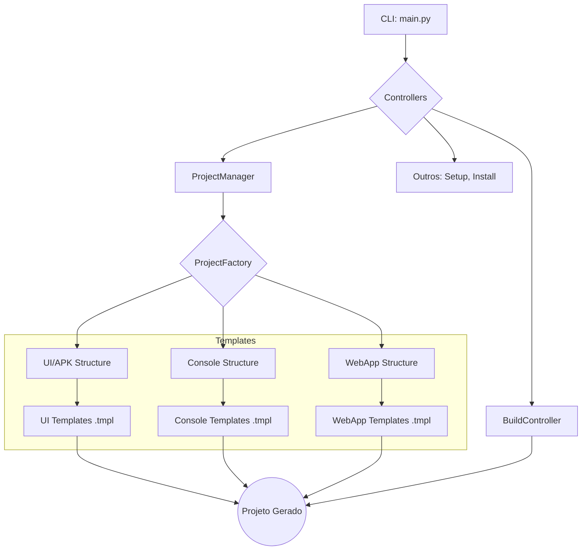

<p align="center">
  
  <br><br>
  <b> 📱 T.A.M.K — Termux APK Manager Kit (v2026) </b>
  <br><br>
  
  
  
  
</p>

---

## 📝 Descrição

O **T.A.M.K (Termux APK Manager Kit)** é um framework de automação profissional para o desenvolvimento nativo de aplicativos Android diretamente no ambiente Termux. Projetado para desenvolvedores que buscam total independência de hardware, ele permite criar, compilar, assinar e instalar aplicativos APK, incluindo **WebApps Híbridos**, utilizando apenas um dispositivo móvel.

Na sua nova versão, o T.A.M.K introduz o suporte a **WebApps**, permitindo que desenvolvedores web possam encapsular seus projetos (HTML, CSS, JavaScript) em um APK nativo, pronto para ser distribuído e instalado em dispositivos Android. A solução utiliza um `WebView` configurado para performance e compatibilidade, oferecendo uma ponte robusta entre o mundo web e o ecossistema Android.

## 🚀 Diferenciais Estratégicos

| Funcionalidade | Descrição |
| :--- | :--- |
| **Suporte a WebApps** | Encapsule qualquer aplicação web estática (HTML/CSS/JS) em um APK instalável, com acesso a recursos nativos básicos via JavaScript. |
| **Isolamento de SDK** | Cada projeto gerado contém sua própria cópia do `android.jar`, garantindo portabilidade e prevenindo conflitos de versão. |
| **Template Engine** | Arquitetura modular que separa a lógica Python dos templates de código (XML, Kotlin, HTML), permitindo customização completa sem alterar o núcleo do sistema. |
| **Pipeline de Build Seguro** | Validação de credenciais da Keystore antes do início da compilação, otimizando tempo e evitando falhas em etapas tardias do processo. |
| **Instalação Nativa** | Integração direta com o instalador de pacotes do Android, proporcionando uma experiência fluida desde o desenvolvimento até o teste. |

## 🏗️ Arquitetura do Projeto

A arquitetura do T.A.M.K foi desenhada para ser modular e extensível. A introdução do suporte a WebApps se integra perfeitamente à estrutura existente, adicionando uma nova opção ao `ProjectFactory`.



## ⚙️ Instalação e Configuração

> **Ambientes Suportados:** Termux e SmartIDE

### 📋 Pré-requisitos

O instalador automático cuida de todas as dependências, mas você pode instalá-las manualmente antes:

```bash
pkg update && pkg upgrade
pkg install -y python openjdk-21 kotlin wget zip apksigner aapt2 termux-tools git ncurses-utils toilet
```

### 🔧 Instalação Automática (Recomendado)

O script `setup-install.sh` realiza toda a configuração automaticamente:

```bash
# 1. Clone o repositório
git clone https://github.com/Shadw-Developer/tamk.git
cd tamk

# 2. Execute o instalador
bash setup-install.sh
```

**O que o instalador faz:**

| Etapa | Descrição |
|-------|-----------|
| 1 | Detecta ambiente (Termux ou SmartIDE) |
| 2 | Verifica e instala dependências faltantes |
| 3 | Copia arquivos para `$PREFIX/opt/tamk` |
| 4 | Cria executável global `tamk` |
| 5 | Configura diretórios (sdk, cache, projects) |
| 6 | Cria arquivo de configuração padrão |

### 🛠️ Instalação Manual (Alternativo)

Se preferir configurar manualmente:

```bash
# 1. Clone o repositório
git clone https://github.com/Shadw-Developer/tamk.git
cd tamk

# 2. Defina o diretório de instalação
export INSTALL_PATH="$PREFIX/opt/tamk"
mkdir -p "$INSTALL_PATH"

# 3. Copie os arquivos
cp -rf . "$INSTALL_PATH/"

# 4. Crie o executável global
cat << EOF > "$PREFIX/bin/tamk"
#!/bin/bash
export TAMK_HOME="$INSTALL_PATH"
python3 "\$TAMK_HOME/src/main.py" "\$@"
EOF

chmod +x "$PREFIX/bin/tamk"

# 5. Crie diretórios necessários
mkdir -p "$INSTALL_PATH/sdk"
mkdir -p "$INSTALL_PATH/.cache"
mkdir -p "$INSTALL_PATH/projects"
```

### ✅ Verificação da Instalação

Após instalar, teste o comando:

```bash
tamk --version
```

**Saída esperada:**
```
✨ T.A.M.K Version: 2026.3.0-HMR
   Environment: termux
   Home: /data/data/com.termux/files/usr/opt/tamk
```

### 🔄 Atualização

Para atualizar o T.A.M.K para a versão mais recente:

```bash
# Via comando interno (recomendado)
tamk --update

# Ou via git
cd $PREFIX/opt/tamk
git pull
bash setup-install.sh
```

### 🗑️ Desinstalação

```bash
# Remove o executável
rm "$PREFIX/bin/tamk"

# Remove os arquivos de instalação
rm -rf "$PREFIX/opt/tamk"

# Limpa cache (opcional)
rm -rf ~/.tamk_cache
```

## 📖 Guia de Uso (CLI)

### 🚀 Guia Rápido

Para começar a usar o T.A.M.K imediatamente, consulte:

👉 **[documentação/QUICKSTART.md](documentation/QUICKSTART.md)** - Guia passo a passo do zero ao primeiro APK

### 📚 Documentação Completa

| Documento | Descrição |
| :--- | :--- |
| [`QUICKSTART.md`](documentation/QUICKSTART.md) | Guia rápido de início (10 minutos) |
| [`ARCHITECTURE.md`](documentation/ARCHITECTURE.md) | Visão geral da arquitetura e fluxo de dados |
| [`API_COMPONENTS.md`](documentation/API_COMPONENTS.md) | Referência de classes, módulos e templates |
| [`DEV_GUIDE.md`](documentation/DEV_GUIDE.md) | Guia de desenvolvimento e debugging |
| [`HMR_SYSTEM.md`](documentation/HMR_SYSTEM.md) | **Hot Module Replacement** - Desenvolvimento em tempo real |
| [`HMR_EXAMPLES.md`](documentation/HMR_EXAMPLES.md) | Exemplos práticos e padrões HMR |
| [`UPDATE_SYSTEM.md`](documentation/UPDATE_SYSTEM.md) | Sistema de atualizações automáticas |
| [`STRUCTURE.md`](documentation/STRUCTURE.md) | Estrutura de diretórios do projeto |
| [`FAQ.md`](documentation/FAQ.md) | Perguntas frequentes |
| [`CHANGELOG.md`](documentation/CHANGELOG.md) | Histórico de mudanças |
| [`CONTRIBUTING.md`](documentation/CONTRIBUTING.md) | Guia de contribuição |

---

<div align="center">
  <sub>Feito com ❤️ por @mrx_dev</sub>
</div>
