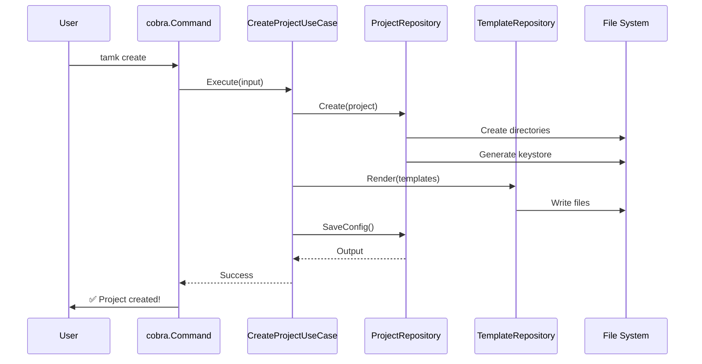
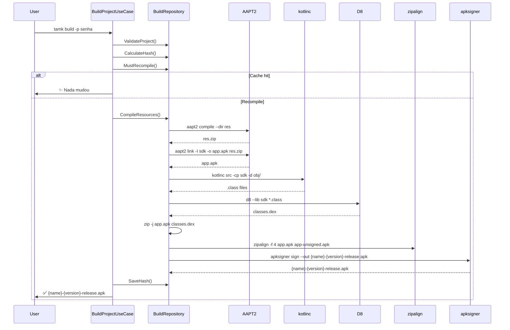
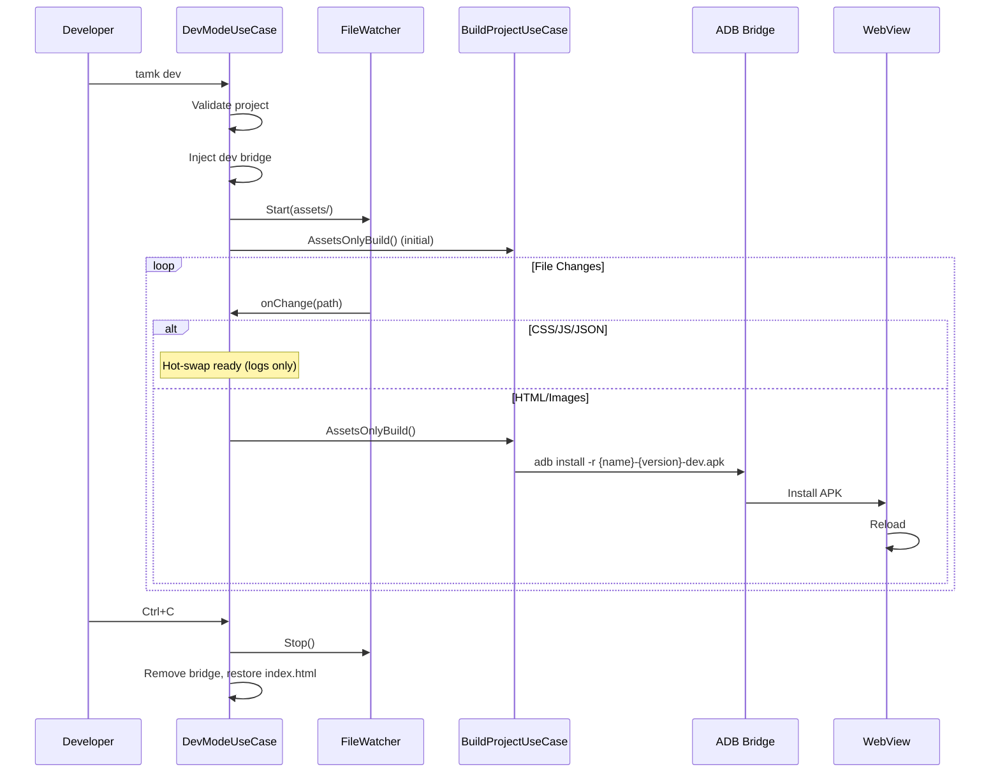

# 🏗️ T.A.M.K Architecture

> **Version:** 2026.3.0-HMR — Complete internal architecture and data flow documentation.

---

## 📋 Overview

T.A.M.K is built with **Clean Architecture v4** in Go. The CLI (Cobra) delegates to use cases that orchestrate domain entities and repositories. Templates are processed via `internal/repository/filesystem/template_repository.go` to generate Android projects.

```
┌──────────────────────────────────────────────────┐
│                  delivery/cli/                    │  Cobra commands
├──────────────────────────────────────────────────┤
│                   usecase/                        │  Business logic
├──────────────────────────────────────────────────┤
│              repository/filesystem/               │  File I/O
│                  repository/                      │  Remote (GitHub API)
├──────────────────────────────────────────────────┤
│     domain/entity/    domain/valueobject/         │  Core types, validation
│     domain/repository/                           │  Interface contracts
├──────────────────────────────────────────────────┤
│              pkg/ (shared utilities)              │  Logger, errors, watcher, qrcode
├──────────────────────────────────────────────────┤
│          internal/config/                         │  Central configuration
└──────────────────────────────────────────────────┘
```

---

## 🗺️ Component Diagram

```mermaid
graph TD
    A[cmd/tamk/main.go] --> B[cobra.Command]
    
    B -->|create| C[CreateProjectUseCase]
    B -->|build| D[BuildProjectUseCase]
    B -->|dev| E[DevModeUseCase]
    B -->|run| F[Run (stub)]
    B -->|setup| G[SetupEnvironmentUseCase]
    B -->|install| H[InstallUseCase]
    B -->|update| I[UpdateUseCase]
    B -->|version| J[Config]
    
    C --> K[ProjectRepository]
    C --> L[TemplateRepository]
    D --> M[BuildRepository]
    D --> K
    E --> D
    E --> K
    I --> N[UpdateRepository]
    
    K & L & M --> O[(File System)]
    N --> P[GitHub API]
    
    E --> S[File Watcher]
    E --> T[ADB Bridge]
```

---

## 🔄 Project Creation Flow

### WebApp (complete example)



---

## 🔄 Full Build Flow



---

## 🔄 HMR (Dev Mode) Flow



---

## 🗄️ Clean Architecture Layers

### Domain Layer (`internal/domain/`)

| Package | Types | Purpose |
| :--- | :--- | :--- |
| `entity/` | `Project`, `ProjectType`, `BuildResult`, `Template`, `Keystore`, `VersionInfo`, `UpdateLevel` | Core domain types, zero external dependencies |
| `valueobject/` | `ProjectName`, `Version`, `PackageName` | Immutable value objects with built-in validation |
| `repository/` | `ProjectRepository`, `BuildRepository`, `TemplateRepository`, `UpdateRepository` | Interface contracts (ports) |

### Use Case Layer (`internal/usecase/`)

| Use Case | Key Methods | Description |
| :--- | :--- | :--- |
| `CreateProjectUseCase` | `Execute(input)` | Project creation wizard, template processing |
| `BuildProjectUseCase` | `FullBuild(ctx, input)`, `AssetsOnlyBuild(ctx, input)` | Full + incremental APK build |
| `DevModeUseCase` | `Start(ctx, projectPath, password)`, `Stop(ctx)` | HMR dev mode orchestrator |
| `SetupEnvironmentUseCase` | `Execute()` | SDK download + keystore generation |
| `InstallUseCase` | `Serve(ctx, projectPath, port)`, `FindAPK()` | HTTP server + QR code for APK download |
| `UpdateUseCase` | `Check(ctx)`, `ShouldAutoInstall(info)`, `ShouldPrompt(info)` | GitHub release checks |
| *(helper)* `zipDir` | `internal/usecase/zip.go` | Archive helper for directory zipping |

### Repository Layer (`internal/repository/`)

| Repository | Implements | Responsibility |
| :--- | :--- | :--- |
| `filesystem.ProjectRepository` | `domain/repository.ProjectRepository` | Project CRUD on disk |
| `filesystem.BuildRepository` | `domain/repository.BuildRepository` | Build pipeline (aapt2, kotlinc, d8, etc.) |
| `filesystem.TemplateRepository` | `domain/repository.TemplateRepository` | Template loading + rendering |
| `update_repository.go` | `domain/repository.UpdateRepository` | GitHub API client |

### Delivery Layer (`internal/delivery/`)

| Package | File | Purpose |
| :--- | :--- | :--- |
| `cli/` | `root.go` | Cobra root command + subcommand wiring |

---

## 🔧 Central Configuration

### `Config` (`internal/config/config.go`)

```go
const Version = "2026.3.0-HMR"

type Config struct {
    Version  string
    Env      Environment  // "termux" | "smartide" | "unknown"
    TAMKHome string       // Base path ($TAMK_HOME or auto-detected)
    DevDir   string       // development/
    SDKPath  string       // development/sdk/android.jar
    Keystore string       // development/secret/debug.keystore
}
```

### Template Resolution

`GetTemplateDir()` searches in order:
1. `$TAMK_HOME/assets/templates/{type}/`
2. Source-relative `assets/templates/{type}/`
3. `cwd/assets/templates/{type}/`
4. `/data/data/com.termux/files/usr/opt/tamk/assets/templates/{type}/`
5. `/usr/opt/tamk/assets/templates/{type}/`

---

## 📊 External Dependencies

| Tool | Usage | Required? |
| :--- | :--- | :--- |
| `go 1.26+` | Core engine | ✅ |
| `openjdk-21` | Kotlin/Java compilation | ✅ (for build) |
| `kotlinc` | Kotlin compiler | ✅ (for build) |
| `aapt2` | Android asset packaging | ✅ (for build) |
| `apksigner` | APK signing | ✅ (for build) |
| `zipalign` | APK alignment | ✅ (for build) |
| `d8` | DEX compiler | ✅ (for build) |
| `keytool` | Keystore generation | ✅ |
| `wget` | SDK download | ✅ (for setup) |
| `zip` | APK packaging | ✅ |
| `toilet` | ASCII art banners | Optional |
| `adb` | Device bridge | Optional (for auto-install) |

---

## 🔐 Security

### Implemented Measures

1. **Path sanitization** — `SanitizePath()` removes `[;&|\`$]` and blocks path traversal
2. **Password handling** — Zeroed after use (`clear` byte slice), redacted in logs
3. **Subprocess safety** — `exec.Command()` list-based (no shell interpolation)
4. **File permissions** — Keystore at `0o600`
5. **SDK validation** — SHA-256 hash verification
6. **Input validation** — Names, versions, packages validated via value objects before creation
7. **Build timeouts** — 10-minute timeout on full build, 5-minute on assets build via `context.WithTimeout`

---

## 📈 Metrics

- **Go source files**: 33 modules
- **Test files**: 11 (`*_test.go`)
- **Templates**: 19 `.tmpl` files
- **Documentation**: 21 `.md` files + VERSIONING.txt
- **Lines of code**: ~3,500 Go, ~300 Kotlin (templates)
- **Go version**: 1.26.3

---

<div align="center">
  <sub>T.A.M.K v2026.3.0-HMR — Architecture Documentation</sub>
</div>
