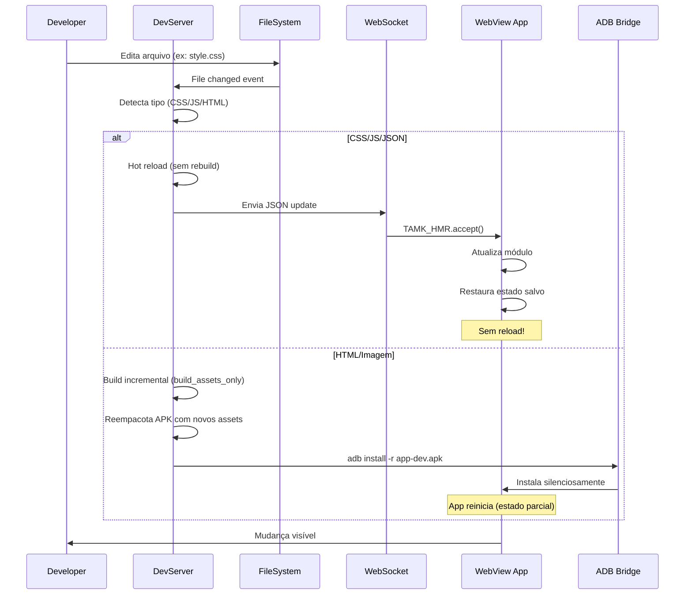

# 🔄 Hot Module Replacement (HMR) - Sistema de Desenvolvimento em Tempo Real

**Versão:** 2026.3.0-HMR  
**Status:** ✅ Production Ready  
**Aplica-se a:** WebApps (HTML/CSS/JS)  
**Requisito:** `tamk --dev`

---

## 📖 Visão Geral

O **HMR (Hot Module Replacement)** do T.A.M.K é um sistema de desenvolvimento que permite atualizar módulos JavaScript, CSS, JSON e HTML **em tempo real** durante o desenvolvimento, **sem necessidade de rebuild completo** e **preservando o estado da aplicação**.

### ✨ Benefícios Principais

| Benefício | Descrição | Impacto |
|-----------|-----------|---------|
| **Preserva Estado** | Formulários preenchidos, scroll position, variáveis em memória são mantidos | Economiza tempo (não precisa repreenchimento) |
| **Feedback Instantâneo** | Mudanças refletidas em < 100ms | Fluxo de trabalho ininterrupto |
| **Build Incremental** | Apenas assets alterados são reenviados | Consumo mínimo de recursos |
| **Instalação Automática** | APK atualizado automaticamente via ADB | Zero atrito no ciclo dev-build-test |

### 🎯 Diferença: Build vs HMR

```
┌─────────────────┬──────────────────────────────┬─────────────────────────────┐
│   Aspecto       │  Build Tradicional          │  HMR (tamk --dev)          │
├─────────────────┼──────────────────────────────┼─────────────────────────────┤
│ Tempo           │ 5-30 segundos (completo)    │ 50-500ms (incremental)     │
│ Rebuild         │ Sim (Kotlin + Recursos)     │ Não (apenas assets)        │
│ Estado App      │ Perdido (app reinicia)      │ Preservado                 │
│ Ciclo           │ Edit → Build → Install → Run│ Edit → See Changes         │
│ ADB Install     │ Manual ou explícito         │ Automático                 │
│ Keystore Check  │ Toda vez                   │ Cache de sessão            │
└─────────────────┴──────────────────────────────┴─────────────────────────────┘
```

---

## 🏗️ Arquitetura do Sistema HMR

### Componentes

```
┌─────────────┐
│  Terminal   │   tamk --dev
│  (Termux)   │─────────────────────────────┐
└─────────────┘                           │
                                          ▼
┌─────────────────────────────────────────────────────────────┐
│                    DevServer (Python)                        │
│  ├── File Watcher ( watchdog )                             │
│  ├── WebSocket Server (port 8765 default)                  │
│  ├── Incremental Builder (assets-only)                     │
│  └── ADB Bridge (instalação automática)                    │
└─────────────────────────────────────────────────────────────┘
                          │
                          │ WebSocket (JSON updates)
                          ▼
┌─────────────┐   ┌─────────────────────────────────────────┐
│  Dispositivo │   │         WebView (App)                   │
│   Android    │   │  ├── TAMK_HMR Bridge (JS injection)   │
│   (App)      │   │  ├── Module Registry                  │
│              │   │  ├── State Manager                   │
└──────────────┘   └─────────────────────────────────────────┘
                         │
                         │ DOM Update
                         ▼
                  ┌─────────────┐
                  │   Usuário   │
                  │   vê mudança│
                  └─────────────┘
```

### Fluxo Detalhado



---

## 🚀 Como Usar

### 1. Iniciar Modo Desenvolvimento

```bash
# Navegue para o diretório do projeto WebApp
cd MeuWebApp

# Inicie o servidor HMR
tamk --dev

# Opções:
tamk --dev --verbose           # Logs detalhados
tamk --dev --ws-port 8080      # Porta WebSocket customizada
tamk --dev --no-ws             # Fallback HTTP only (sem WS)
```

**Output esperado:**
```
✨ T.A.M.K DevServer v2026.3.0-HMR
├─ Watch: /data/data/.../MeuWebApp/src/main/assets
├─ WS: ws://localhost:8765
├─ ADB: connected ✓
└─ HMR: ready (aguardando app...)

[INFO] Aguardando conexão do app...
[INFO] App conectado! HMR ativo.
```

### 2. Preparar o App

O app WebApp já possui o bridge HMR incorporado automaticamente. Basta:

1. Ter o app **instalado** (`tamk --install` ou build anterior)
2. Abrir o app no dispositivo
3. O WebView se conecta automaticamente ao DevServer

**Observação:** A primeira conexão pode levar 1-2 segundos.

### 3. Desenvolver Normalmente

Edite arquivos em `src/main/assets/`:

```
MeuWebApp/
├── src/main/assets/
│   ├── index.html      ← Edite aqui
│   ├── css/
│   │   └── styles.css  ← Hot reload instantâneo
│   ├── js/
│   │   ├── app.js      ← HMR module injection
│   │   └── components/ ← Cada módulo separately
│   └── data/
│       └── config.json ← Data update instantâneo
```

### 4. Monitorar Mudanças

O terminal do `tamk --dev` mostra:

```
[WATCH] css/styles.css modified
[HMR] Tipo: CSS → Hot reload
[ADB] Enviando update...

[WATCH] js/app.js modified
[HMR] Tipo: JS → Module injection
[ADB] APK atualizado: app-dev.apk

[STATUS] Uptime: 45s | Builds: 3 | Clientes: 1 | Módulos: 8
```

Press `s` no terminal para ver status detalhado.

---

## 📚 HMR API (JavaScript)

O bridge é injetado automaticamente no app como `window.TAMK_HMR` e `window.TAMK_DEV`.

### TAMK_HMR

#### `TAMK_HMR.accept(handler)`

Registra um handler para receber updates de módulos.

```javascript
// Handler global (todos os módulos)
TAMK_HMR.accept(function(update) {
  console.log('Update:', update.modulePath);
  console.log('Tipo:', update.type); // 'css' | 'js' | 'json' | 'html'
  console.log('Conteúdo:', update.newContent);
  return true; // Aceita o update
});

// Handler específico para módulo
TAMK_HMR.accept('js/app.js', function(update) {
  console.log('app.js atualizado!');
  // Re-inicializa apenas este módulo
  if (window.myApp && window.myApp.reload) {
    window.myApp.reload();
  }
  return true;
});
```

**Parâmetros do handler:**
- `update.modulePath` (string): Caminho relativo (ex: `js/app.js`)
- `update.type` (string): Tipo do arquivo
- `update.newContent` (string): Conteúdo atualizado
- `update.timestamp` (number): Timestamp da mudança

**Retorno:**
- `true`: Aplica update automaticamente
- `false`: Força full reload (recria app)

#### `TAMK_HMR.saveState(key, value)`

Salva estado para recuperação após um update.

```javascript
// Salvar formulário antes de update
TAMK_HMR.saveState('formData', {
  name: document.getElementById('name').value,
  email: document.getElementById('email').value,
  checkbox: document.getElementById('terms').checked
});

// Salvar scroll position
TAMK_HMR.saveState('scrollY', window.scrollY);

// Salvar estado de aplicação complexo
TAMK_HMR.saveState('appState', {
  currentPage: 2,
  cartItems: cart.items,
  userPreferences: settings
});
```

#### `TAMK_HMR.getState(key)`

Recupera estado salvo (útil no handler accept).

```javascript
TAMK_HMR.accept(function(update) {
  // Restaura formulário
  const saved = TAMK_HMR.getState('formData');
  if (saved) {
    document.getElementById('name').value = saved.name || '';
    document.getElementById('email').value = saved.email || '';
    document.getElementById('terms').checked = saved.checkbox || false;
  }
  
  // Restaura scroll
  const scroll = TAMK_HMR.getState('scrollY');
  if (scroll) window.scrollTo(0, scroll);
  
  return true;
});
```

#### `TAMK_HMR.dispose(modulePath)`

Remove handler e limpa módulo do registry.

```javascript
// Quando um módulo é descontinuado
TAMK_HMR.dispose('js/old-module.js');

// Ou dispose global ao unload
window.addEventListener('beforeunload', () => {
  TAMK_HMR.dispose('*'); // Remove todos
});
```

---

### TAMK_DEV

Objeto global com informações do ambiente de desenvolvimento.

#### Propriedades

```javascript
console.log(TAMK_DEV);
// {
//   ws: WebSocket,           // Conexão WebSocket
//   hmr: {                   // Config HMR
//     enabled: true,
//     debug: false
//   },
//   connected: true,
//   uptime: 12500,
//   builds: 5
// }
```

#### Controles

```javascript
// Enable/disable debug mode
TAMK_DEV.hmr.debug = true;  // Logs detalhados no console

// Verificar status da conexão
console.log('WebSocket readyState:', TAMK_DEV.ws.readyState);
// 0 = CONNECTING, 1 = OPEN, 2 = CLOSING, 3 = CLOSED

// Listar módulos registrados
console.log(TAMK_DEV.listModules());
// ['js/app.js', 'css/styles.css', 'data/config.json']
```

---

## 🎯 Comportamento por Tipo de Arquivo

| Extensão | Processamento | Preserva Estado | Reload Necessário |
|----------|---------------|-----------------|-------------------|
| `.css` | CSS injection ( `<style>` replacement ) | ✅ Sim | ❌ Não |
| `.js` | `eval()` do novo código + handlers | ✅ Sim | ❌ Não |
| `.json` | Atualiza objeto em memória | ✅ Sim | ❌ Não |
| `.html` | Rebuild + install APK | ⚠️ Parcial | ✅ Sim |
| `.png`, `.jpg`, `.svg` | Rebuild + install APK | ⚠️ Parcial | ✅ Sim |
| `.txt`, `.md` | Apenas copiado ao assets | N/A | ❌ Não |

### Exemplo: CSS Hot Reload

```css
/* src/main/assets/css/styles.css */

/* Edit: muda cor de fundo */
body {
  background-color: #1a1a2e;  /* ← Mudou aqui */
  color: #ffffff;
}

/* Adiciona nova classe */
.new-feature {
  animation: fadeIn 0.3s ease;
}
```

**Resultado:** Mudança instantânea sem reload. Estado dos formulários preservado.

### Exemplo: JS HMR

```javascript
// src/main/assets/js/app.js

window.App = {
  version: '1.0.0',
  init: function() {
    console.log('App v' + this.version + ' iniciado');
    this.setupEventListeners();
  },
  setupEventListeners: function() {
    document.getElementById('btn').addEventListener('click', () => {
      alert('Clicado!');
    });
  }
};

// HMR Handler (para preservar listeners)
TAMK_HMR.accept('js/app.js', function(update) {
  console.log('Nova versão do app.js carregada');
  
  // Salva estado crítico
  const oldVersion = window.App.version;
  
  // Eval do novo código (cria nova versão da função)
  eval(update.newContent);
  
  // Verifica se version foi atualizada
  if (window.App.version !== oldVersion) {
    console.log('Version:', oldVersion, '→', window.App.version);
  }
  
  // Re-aplica listeners se necessário
  if (window.App.setupEventListeners) {
    window.App.setupEventListeners();
  }
  
  return true;
});

// Auto-init
window.App.init();
```

---

## 🔧 Configuração Avançada

### Configuração Via `tamk --dev`

```bash
# Modo verboso (debug)
tamk --dev --verbose

# Porta WebSocket alternativa
tamk --dev --ws-port 8080

# Sem WebSocket (fallback polling HTTP - experimental)
tamk --dev --no-ws
```

### Configuração no HTML

```html
<!DOCTYPE html>
<html>
<head>
  <meta charset="UTF-8">
  <title>{{NAME}}</title>
  
  <!-- Configurações HMR ANTES do bridge carregar -->
  <script>
  window.TAMK_CONFIG = {
    hmrEnabled: true,           // Padrão: true
    debugMode: false,           // Logs extensivos
    maxReconnectAttempts: 15,   // Tentativas de reconexão WS
    reconnectInterval: 2000,    // ms entre tentativas
    autoInstall: true,          // Instala APK automaticamente
    wsUrl: 'ws://localhost:8765' // URL customizada WS
  };
  </script>
</head>
<body>
  <!-- Seu app aqui -->
  
  <!-- O bridge HMR é injetado automaticamente WebView -->
  <!-- NÃO inclua manualmente, o MainActivity injeta via loadUrl -->
</body>
</html>
```

---

## 🐛 Troubleshooting

### Problema: "HMR não está funcionando"

**Diagnóstico:**

```javascript
// No console do WebView (Chrome Inspect)
console.log('TAMK_DEV:', window.TAMK_DEV);
console.log('HMR enabled:', window.TAMK_DEV?.hmr?.enabled);
console.log('WS readyState:', window.TAMK_DEV?.ws?.readyState);
console.log('Modules:', window.TAMK_DEV?.listModules?.());
```

**Solução:**

1. **WebSocket não conecta**
   - Verifique se `tamk --dev` está rodando
   - Verifique firewall/permissões de rede
   - Tente `--ws-port` diferente
   - Confirme que o app está na mesma rede (Wi-Fi)

2. **`TAMK_DEV` é `undefined`**
   - O bridge não foi injetado
   - Verifique `MainActivity.kt` se está chamando `loadUrl("file:///android_asset/index.html")`
   - assets/index.html deve existir

3. **Atualizações não chegam**
   - Verifique logs do terminal `tamk --dev --verbose`
   - Arquivo está em `src/main/assets/`?
   - Extensão suportada? (css/js/json/html)

### Problema: "Estado do formulário é perdido"

**Causa:** CSS updates não perdem estado, mas HTML updates causam reload parcial.

**Solução:**

```javascript
// Auto-save em todos os inputs
document.querySelectorAll('input, textarea, select').forEach(el => {
  el.addEventListener('input', function() {
    TAMK_HMR.saveState('form_' + this.id, this.value);
  });
});

// Restore no handler
TAMK_HMR.accept(function(update) {
  document.querySelectorAll('[id]').forEach(el => {
    const saved = TAMK_HMR.getState('form_' + el.id);
    if (saved !== undefined) el.value = saved;
  });
  return true;
});
```

### Problema: "APK não instala automaticamente"

**Diagnóstico no terminal:**
```
[ADB] ADB not found ou device offline
```

**Solução:**

1. Verifique conexão ADB:
   ```bash
   adb devices
   # Deve listar seu dispositivo
   ```

2. Se não houver ADB, o APK é salvo como `app-dev.apk` no projeto. Instale manualmente:
   ```bash
   adb install -r app-dev.apk
   ```

3. Confirme que o app está **assado** (keystore configurada).

---

## 📊 Performance e Limitações

### Limitações Conhecidas

| Limitação | Razão Técnica | Workaround |
|-----------|---------------|------------|
| HTML/Imagens exigem rebuild | Android packaging requer zipEntry recriação | Use CSS/JS para UI dinâmica |
| Não suporta TypeScript HMR | Requer transpilação (perda de velocidade) | Use Babel watch mode externo |
| Estado complexo pode vazar | State storage em WebView localStorage | Limpe handlers com `dispose()` |
| Max 15 reconnect attempts | Evita loop infinito no WS | Aumente via `TAMK_CONFIG` |

### Otimizações

1. **Assets Assetbundle**: O build_assets_only empacota apenas assets, ignorando código Kotlin
2. **Incremental Zip**: Usa `zipfile` Python para APK delta, não full rebuild
3. **WS Binary Frames**: Usa JSON compacto, < 1KB por update típico
4. **Debounce File Watcher**: 100ms debounce evita rebuilds múltiplos

---

## 🔮 Futuro (Roadmap)

| Feature | Status | ETA |
|---------|--------|-----|
| TypeScript HMR via esbuild | Planejado | v2026.4.0 |
| Module dependency graph | Em design | v2026.5.0 |
| Partial page updates (frame-based) | WIP | v2026.4.0 |
| React/Vue integration (via Babel) | Backlog | v2026.6.0 |
| Remote debugging overlay (FPS, mem) | Backlog | v2026.5.0 |
| HMR para plugins Kotlin (DexClassLoader) | Research | v2027.0.0 |

---

## 📚 Exemplos Práticos

### Exemplo 1: App com Múltulos Módulos JS

```
assets/
├── js/
│   ├── app.js           ← Main module
│   ├── navigation.js    ← Nav module
│   ├── cart.js          ← Cart module
│   └── products.js      ← Products module
├── css/
│   └── styles.css
└── index.html
```

**app.js:**
```javascript
import { Navigation } from './navigation.js';
import { Cart } from './cart.js';

window.App = {
  init: function() {
    Navigation.init();
    Cart.init();
    console.log('App completo!');
  }
};

// HMR handlers por módulo
TAMK_HMR.accept('js/navigation.js', (update) => {
  console.log('Navigation atualizado');
  eval(update.newContent);
  Navigation.init(); // Reinicia apenas nav
});

TAMK_HMR.accept('js/cart.js', (update) => {
  console.log('Cart atualizado');
  const state = Cart.getState();
  eval(update.newContent);
  Cart.setState(state);
});

window.App.init();
```

### Exemplo 2: Preservar Scroll e Seleção de Texto

```javascript
// Auto-save
let saveScroll = () => TAMK_HMR.saveState('scrollY', window.scrollY);
window.addEventListener('scroll', saveScroll);

let saveSelection = () => {
  const sel = window.getSelection();
  if (sel.rangeCount > 0) {
    const range = sel.getRangeAt(0);
    TAMK_HMR.saveState('selection', {
      start: range.startOffset,
      end: range.endOffset,
      text: sel.toString()
    });
  }
};
document.addEventListener('selectionchange', saveSelection);

// Restore
TAMK_HMR.accept(() => {
  const scroll = TAMK_HMR.getState('scrollY');
  if (scroll) window.scrollTo(0, scroll);
  
  const selData = TAMK_HMR.getState('selection');
  if (selData) {
    // Reaplica seleção (requer DOM ready)
    setTimeout(() => {
      const el = document.activeElement;
      if (el) {
        const range = document.createRange();
        range.setStart(el, selData.start);
        range.setEnd(el, selData.end);
        const sel = window.getSelection();
        sel.removeAllRanges();
        sel.addRange(range);
      }
    }, 0);
  }
  return true;
});
```

### Exemplo 3: Transição Suave CSS

```css
/* styles.css */
body {
  background: linear-gradient(135deg, #667eea 0%, #764ba2 100%);
  transition: background 0.5s ease; /* Smooth transition */
}

.button-primary {
  background-color: #667eea;
  transition: all 0.3s ease;
}

.button-primary:hover {
  background-color: #764ba2;
  transform: translateY(-2px);
}
```

Com hot reload, cores e animações mudam instantaneamente, sem piscar.

---

## 🎓 Melhores Práticas

### 1. Sempre Registre Handlers para Módulos Críticos

```javascript
// ❌ RUIM - sem handler, estado perde
// js/cart.js (conteúdo puro)

// ✅ BOM - com handler
TAMK_HMR.accept('js/cart.js', function(update) {
  const state = window.Cart.save();
  eval(update.newContent);
  window.Cart.restore(state);
  return true;
});
```

### 2. Salve Estado Antes de Operações Destrutivas

```javascript
document.getElementById('clearBtn').addEventListener('click', () => {
  // Salva estado antes de limpar
  TAMK_HMR.saveState('cartBeforeClear', window.Cart.items);
  
  window.Cart.clear();
});
```

### 3. Limpe Módulos Descontinuados

```javascript
// Quando remover um módulo antigo
if (window.oldModule) {
  TAMK_HMR.dispose('js/old-module.js');
  delete window.oldModule;
}
```

### 4. Teste Fallback (Full Reload)

Seu app deve funcionar mesmo se HMR falhar e forçar reload completo:

```javascript
if (!window.TAMK_DEV || !window.TAMK_DEV.hmr.enabled) {
  console.log('HMR indisponível - faisant full reload test');
  // Certifique-se que localStorage/IndexedDB persiste
}
```

### 5. Não Use Estado Muito Volátil

```javascript
// ❌ Evite - estado muito volátil
TAMK_HMR.saveState('temporaryCounter', counter);

// ✅ Prefira - estado estável e estruturado
TAMK_HMR.saveState('userSession', {
  userId: 123,
  token: 'abc...',
  preferences: { theme: 'dark' }
});
```

---

## 🔍 Referência Técnica

### build_controller.py - Métodos Relevantes

```python
class BuildController:
    def build_assets_only(password=None) -> bool:
        """
        Build incremental apenas de assets.
        1. Extrai app-final.apk ou app-dev.apk
        2. Substitui pasta assets/
        3. Reempacota e reassina
        4. Instala via adb (se disponível)
        """
        # ...
        
    def _try_install(apk_path):
        """
        Tenta instalação automática via adb.
        Se adb disponível e device conectado:
            adb install -r apk_path
        """
```

### DevController (dev_controller.py)

```python
def start_dev_mode(password=None, verbose=False, no_ws=False, ws_port=8765):
    """
    1. Inicia WebSocket server na porta ws_port
    2. Inicia File Watcher em src/main/assets/
    3. Spin off thread para ADB polling
    4. Loop principal: monitora arquivos → triggers HMR
    """
```

### WebView Bridge (MainActivity.kt)

```kotlin
// Em onCreate(), após webView.loadUrl():
webView.addJavascriptInterface(object {
    @JavascriptInterface
    fun log(message: String) {
        Log.d("HMR-Bridge", message)
    }
}, "TAMK_DEV")
```

---

## 📖 Ver Também

- **QUICKSTART.md** - Guia rápido de criação de WebApp
- **DEV_GUIDE.md** - Ambiente de desenvolvimento full
- **ANDROID_APK_INSTALL.md** - Detalhes sobre instalação ADB
- **HMR_GUIDE.md** (anterior) - Esta documentação expandida

---

<div align="center">
  <sub>HMR System © 2026 T.A.M.K — Desenvolvido para produtividade móvel</sub>
</div>
