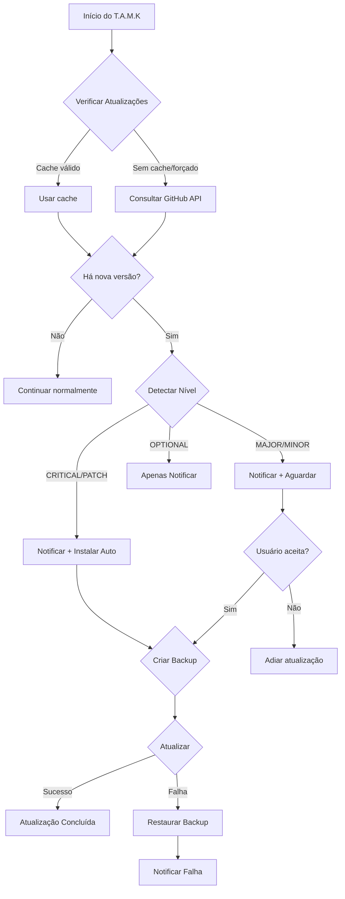

# 🔄 Sistema de Atualizações do T.A.M.K

Este documento descreve o sistema de atualizações automáticas com níveis de prioridade do T.A.M.K.

## 📋 Visão Geral

O sistema de atualizações do T.A.M.K foi projetado para manter a ferramenta sempre atualizada de forma inteligente, priorizando a estabilidade e a segurança do ambiente do usuário.

### ✨ Características Principais

- **Detecção automática** de novas versões via GitHub API
- **Níveis de prioridade** para diferentes tipos de atualização
- **Instalação automática** para patches críticos e de segurança
- **Notificação visual** com banners coloridos
- **Cache inteligente** para evitar verificações excessivas
- **Backup automático** antes de atualizar
- **Rollback automático** em caso de falha

## 🎯 Níveis de Atualização

O sistema classifica as atualizações em 4 níveis de prioridade:

| Nível | Descrição | Comportamento | Exemplo |
|-------|-----------|---------------|---------|
| 🔴 **CRITICAL** | Correções de segurança ou bugs críticos | Instalação **automática** imediata | Vulnerabilidades, crashes graves |
| 🟡 **PATCH** | Correções de bugs menores | Instalação **automática** em segundo plano | Pequenos fixes, melhorias de estabilidade |
| 🟢 **MAJOR/MINOR** | Novas funcionalidades e melhorias | **Pergunta** ao usuário se deseja atualizar | Novos recursos, mudanças significativas |
| 🔵 **OPTIONAL** | Atualizações cosméticas ou opcionais | Apenas **notifica** sem pressionar | Documentação, exemplos, templates |

### Como o Sistema Detecta o Nível

O sistema analisa:

1. **Versão semântica**: Compara major.minor.patch
2. **Palavras-chave nas notas de release**:
   - `critical`, `security`, `urgent`, `importante`, `obrigatória` → CRITICAL
   - `patch`, `bugfix`, `correção`, `fix`, `hotfix` → PATCH
   - Mudança no número major → MAJOR
   - Mudança no número minor → MINOR

## 🚀 Uso

### Verificação Automática

Por padrão, o T.A.M.K verifica atualizações automaticamente ao iniciar:

```bash
tamk --create
tamk --build
tamk --dev
# etc...
```

### Comando de Atualização Manual

Para verificar e instalar atualizações manualmente:

```bash
tamk --update
```

### Desabilitar Verificação Automática

Para executar comandos sem verificar atualizações:

```bash
tamk --create --no-update-check
```

## 📁 Estrutura de Arquivos

```
src/utils/
├── update_checker.py    # Verificação de versões e níveis
├── auto_updater.py      # Instalação automática e backup
└── colors.py            # Utilitários de cor (existente)
└── banner.py            # Utilitários de banner (existente)
```

## 🔧 Configuração

### Cache de Verificação

As verificações são cacheadas por **6 horas** para evitar requisições excessivas à API do GitHub.

**Local do cache:**
- Termux: `~/.tamk_cache/update_cache.json`
- TAMK_HOME definido: `$TAMK_HOME/.cache/update_cache.json`

### Forçar Verificação

O cache é ignorado quando:
- O usuário executa `tamk --update`
- A verificação automática falha
- O arquivo de cache está corrompido

## 🛡️ Segurança

### Backup Automático

Antes de qualquer atualização, o sistema:

1. Cria um backup da instalação atual
2. Salva informações da versão atual
3. Mantém o backup até confirmação de sucesso

### Rollback em Caso de Falha

Se a atualização falhar:

1. O sistema detecta o erro automaticamente
2. Restaura o backup criado
3. Notifica o usuário sobre a falha

### Métodos de Atualização Suportados

O sistema detecta automaticamente como o T.A.M.K foi instalado:

| Método | Comando de Atualização |
|--------|----------------------|
| **Git** | `git pull --rebase --autostash` |
| **pip** | `pip install --upgrade tamk` |
| **Script** | `bash setup-install.sh` |

## 📊 Fluxo de Atualização



## 🎨 Notificações Visuais

O sistema usa banners coloridos para notificar o usuário:

### Atualização Crítica
```
╔══════════════════════════════════════════╗
║  ⚠️ ATUALIZAÇÃO CRÍTICA                   ║
╠══════════════════════════════════════════╣
║Uma atualização CRÍTICA está disponível!  ║
║                                          ║
║  Versão atual: v2026.3.0                 ║
║  Nova versão: v2026.3.1                  ║
║                                          ║
║  Esta atualização será instalada         ║
║  automaticamente.                        ║
╚══════════════════════════════════════════╝
```

### Nova Versão (Major/Minor)
```
╔════════════════════════════════════════╗
║  ✨ ATUALIZAÇÃO                        ║
╠════════════════════════════════════════╣
║  Nova versão disponível!               ║
║                                        ║
║  Versão: v2026.4.0                     ║
║                                        ║
║ Execute 'tamk --update' para atualizar.║
╚════════════════════════════════════════╝
```

## 🔍 Exemplos de Uso

### Exemplo 1: Atualização Crítica Automática

```bash
$ tamk --create

⚠️ ATUALIZAÇÃO CRÍTICA DETECTADA!
Instalando automaticamente: v2026.3.0 → v2026.3.1

📥 Baixando atualização via git...
✓ Código atualizado com sucesso

╔════════════════════════════════════════╗
║  ✅ ATUALIZAÇÃO CONCLUÍDA              ║
╠════════════════════════════════════════╣
║  T.A.M.K atualizado para v2026.3.1     ║
║                                        ║
║  💡 Reinicie o terminal para aplicar   ║
║     as mudanças.                       ║
╚════════════════════════════════════════╝
```

### Exemplo 2: Atualização Major (Pergunta)

```bash
$ tamk --build

╔════════════════════════════════════════╗
║  ✨ ATUALIZAÇÃO                        ║
╠════════════════════════════════════════╣
║  Nova versão disponível!               ║
║                                        ║
║  Versão: v2027.0.0                     ║
║                                        ║
║ Execute 'tamk --update' para atualizar.║
╚════════════════════════════════════════╝

$ tamk --update

📦 ATUALIZAÇÃO DISPONÍVEL
v2026.3.0 → v2027.0.0

Nível: MAJOR
Publicada: 2026-03-29

Notas de release:
🚀 Novas funcionalidades...

==================================================
Deseja atualizar agora?
==================================================
[Y/n]: y

📥 Baixando atualização via git...
✓ Código atualizado com sucesso
```

## 🐛 Troubleshooting

### Problema: Verificação falha constantemente

**Solução:** Use o modo offline temporariamente
```bash
tamk --create --no-update-check
```

### Problema: Atualização falha no meio do processo

**Solução:** O sistema deve restaurar automaticamente. Se não:
```bash
# Reinstale manualmente
cd /path/to/tamk
git pull
bash setup-install.sh
```

### Problema: Cache corrompido

**Solução:** Limpe o cache manualmente
```bash
rm -rf ~/.tamk_cache
# ou
rm -rf $TAMK_HOME/.cache
```

## 📝 API Pública

### UpdateChecker

```python
from utils.update_checker import UpdateChecker, UpdateLevel

checker = UpdateChecker(current_version="2026.3.0")
latest = checker.check_for_updates(force=False)

if latest:
    print(f"Nova versão: {latest.version_str}")
    print(f"Nível: {latest.level}")  # UpdateLevel.CRITICAL, etc.
    
    info = checker.get_update_info()
    print(f"Notas: {info['body']}")
    print(f"URL: {info['url']}")
```

### AutoUpdater

```python
from utils.auto_updater import AutoUpdater, run_update_check, interactive_update

# Verificação automática com instalação de críticos
run_update_check(current_version="2026.3.0", auto_critical=True)

# Atualização interativa (comando --update)
success = interactive_update(current_version="2026.3.0")
```

## 🤝 Contribuindo

Ao criar um novo release no GitHub, use palavras-chave nas notas para classificar corretamente:

```markdown
### Critical Fix
- Security patch for XSS vulnerability

### ou

### Patch
- Bugfix: Fixed crash on Android 14

### ou

### Features
- Added new WebApp template
- Improved build performance
```

## 📄 Licença

MIT License - T.A.M.K Team
